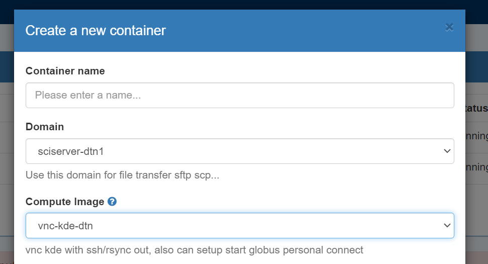
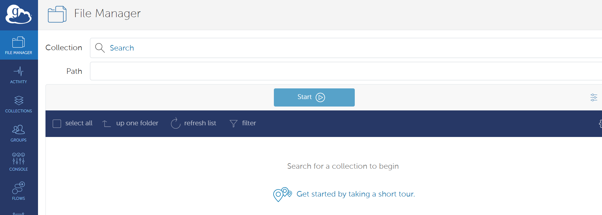

# Data Transfer Use File app in SciServer

There is a File app on SciServer dashboard, which you can do basic file transfer between your workstation/laptop and SciServer. You can upload and download files up to 250GB in file size.  So if you have  directory of files which you need transfer , you may just tar/zip it and tranfer with File app.

From any compute container , you can zip/unzip, tar/untar. 

However File app can not transfer files from/to other servers on internet. Also not conveninet if you want transfer large data sets or need keep updating part of the data.

# Use BNL SDCC as stage of data transfer
If you have BNL SDCC account , you can use  Globus to transfer file from out side to SDCC's Globus endpoint. Or can use sftp to transfer files to SDCC's sftp server sftp.sdcc.bnl.gov. On SDCC's account users can use /hpcgpfs01/scratch area for temperary data up to 2TB ( files subject for deletion if untouched for 30 days) .   
PLease note sftp.sdcc.bnl.gov only use ssh public key and no shell access, only sftp.

Transfer data from SciServer to SDCC storage can be done from any computing container with sftp to 198.125.209.28 or 198.125.209.29.
But you need copy of your private key to sciserver  for this to work. Please understand the security risk before you do it.


# Use dtn container for ssh/sftp based data transfer
On SciServer compute, you can create and start  a conatainer in "sciserver-dtn1" compute domain use the "vnc-kde-dtn" image. Make sure you mount the volumes which you want transfer data to/from when you create container ,some user volumes are maybe not mounted by default.

Unlike other computing  container, this compute domain do have outging ssh access to internet.  From the terminal you can start ssh/scp/sftp/rsync sessions to internet ssh/sftp servers. 

It also make ssh-key based git push/pull easier

Please remember stop the container after stop data transfer. There are limited number of sessions can be started on this compute domain. They are shared by all users.


# Use Globus Personal Connect client
This is useful if you want transfer data between sciserver and data located on a public Globus Endpoint. 


Globus is a secure, high-performance data management platform designed for research and academic environments. It simplifies the process of transferring, sharing, and synchronizing large datasets across distributed storage systems, including supercomputers, cloud storage, and personal devices. 

## Initial setup
Before using Globus on SciServer for the first time, some setup is required.

### 0. Start a SciServer Session using the sciserver-dtn1 domain and the vnc-kde-dtn image:

Connect to this session and follow the steps below.

### 1. Create a personal globus endpoint.
 Create an endpoint and generate a key for the endpoint setup [https://app.globus.org/collections/gcp?generate_key=true](https://app.globus.org/collections/gcp?generate_key=true). You will need to provide a name for your endpoint and  copy the key displayed on the webpage. You will need to paste it in the upcomming setup step.

### 2. Start Globus Connect Personal and use the key to setup your personal endpoint. 
```html
$ globusconnectpersonal -dir /home/idies/workspace/Storage/[your_username]/persistent/.globusonline -setup --setup-key ${your_setup_key}
```

### 3. Start your Globus Connect Personal endpoint.
```bash
$ globusconnectpersonal -dir /home/idies/workspace/Storage/[your_username]/persistent/.globusonline -start &
```
You should now be able to see your personal endpoint when using the Collection search bar on [https://app.globus.org/file-manager?two_pane=true](https://app.globus.org/file-manager?two_pane=true), shown below.



### 6. Stop your endpoint:
Once your data transfer is complete, you can stop your endpoint with:
```html
$ globusconnectpersonal -dir /home/idies/workspace/Storage/[your_username]/persistent/.globusonline -stop
```

## Regular use
After completing the initial setup as detailed above, your globus-related dot files should be located in a persistent storage location. Therefore, you should be able to start and stop your endpoint simply by using the start and stop commands.

```bash
$ globusconnectpersonal -dir /home/idies/workspace/Storage/[your_username]/persistent/.globusonline -start &
```

```html
$ globusconnectpersonal -dir /home/idies/workspace/Storage/[your_username]/persistent/.globusonline -stop
```

For longer transfers, make sure your session stays active until the transfer completes.
